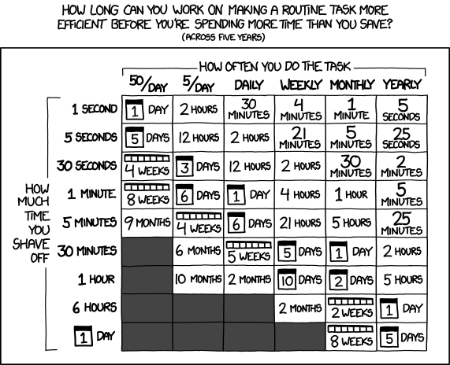

# shouldiautomateit

[](https://github.com/jakewarren/shouldiautomateit/releases)
[](https://github.com/jakewarren/shouldiautomateit/blob/master/LICENSE)
[](https://goreportcard.com/report/github.com/jakewarren/shouldiautomateit)

> Interactive wizard to give guidelines on how long should be spent automating a task


## Table of Contents

- [Background](#background)
- [Install](#install)
- [Usage](#usage)
- [Maintainers](#maintainers)
- [Contribute](#contribute)
- [License](#license)

## Background

Inspired by https://xkcd.com/1205/



## Install

### Option 1: Binary

Download the latest release from [https://github.com/jakewarren/shouldiautomateit/releases](https://github.com/jakewarren/shouldiautomateit/releases)

### Option 2: From source

```
go get github.com/jakewarren/shouldiautomateit
```


## Maintainers

[@jakewarren](https://github.com/jakewarren)

## Contribute

PRs accepted.

## License

MIT © 2017 Jake Warren
